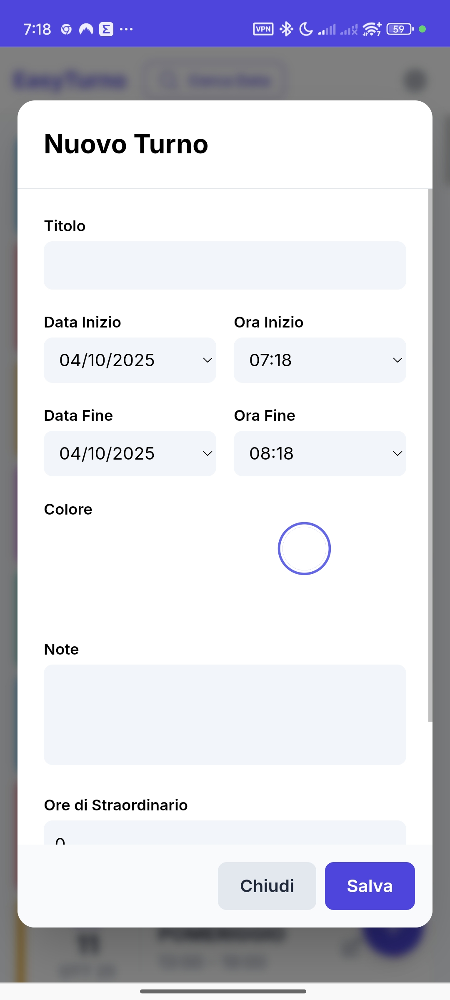
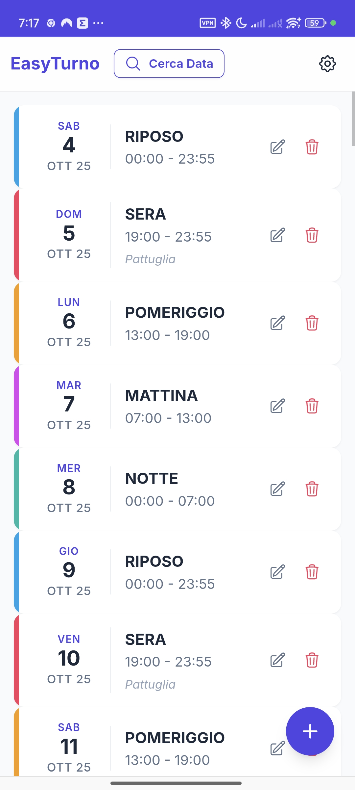
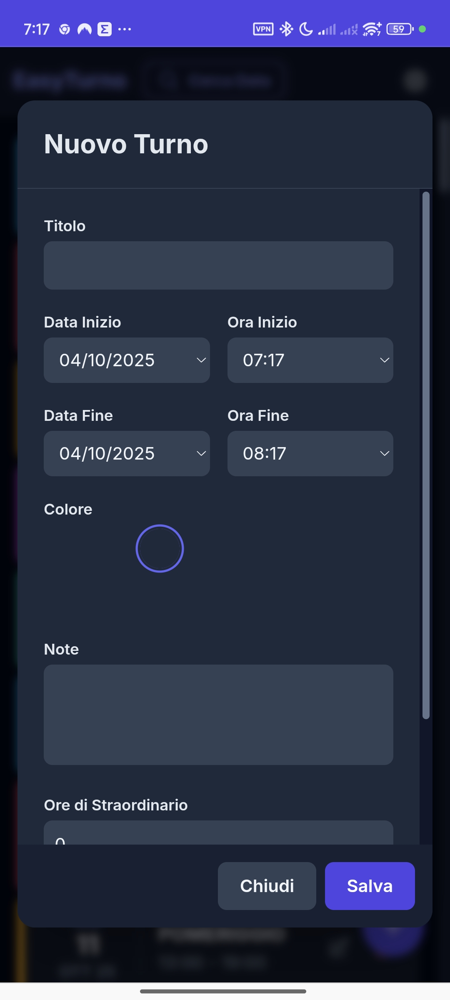
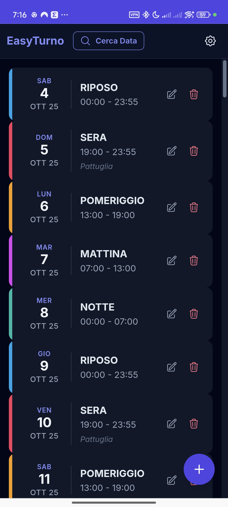

# EasyTurno

PWA per la gestione dei turni di lavoro, offline-first, ottimizzata per mobile.

<p align="center">
  
  
  
  
</p>

## Funzionalita principali

- Creazione, modifica e cancellazione turni singoli e ricorrenti (giornalieri, settimanali, mensili, annuali)
- Vista lista con ricerca per data e paginazione, vista calendario mensile con gesture swipe
- Tracciamento straordinari e indennita multiple per turno
- Dashboard statistiche con riepilogo ore, straordinari e indennita per periodo
- Backup/ripristino dati in formato JSON con validazione, con supporto a backup cifrati protetti da password
- Tema chiaro/scuro con rilevamento automatico preferenza di sistema
- Multilingua italiano/inglese
- Dati cifrati localmente con AES-GCM 256-bit
- Service worker con caching offline-first e rilevamento aggiornamenti PWA
- Notifiche locali su piattaforme native (Android via Capacitor)

## Stack tecnologico

| Tecnologia | Versione |
|---|---|
| Angular | 21.2.5 |
| TypeScript | 5.9.3 |
| Tailwind CSS | 4.2.2 |
| Capacitor | 8.3.0 |
| Jest | 30.2.0 |
| Cypress | 15.3.0 |
| Playwright | 1.58.2 |

## Avvio rapido

```bash
# Richiede Node.js 22+

# Installazione dipendenze
npm install

# Server di sviluppo (porta 3000)
npm run dev

# Build di produzione
npm run build

# Preview build di produzione
npm run preview
```

L'app di sviluppo e disponibile di default su `http://localhost:3000/`.

## Comandi utili

```bash
# Lint e formattazione
npm run lint          # Controlla errori ESLint
npm run lint:fix      # Correggi errori auto-fixabili
npm run format        # Formatta con Prettier
npm run format:check  # Verifica formattazione

# Test
npm test              # Unit test Jest (singola esecuzione)
npm run test:watch    # Unit test in watch mode
npm run test:coverage # Report copertura (output in coverage/)
npm run e2e           # Avvia dev server + test E2E Cypress
npm run test:pw:install # Installa Chromium per Playwright
npm run test:pw       # Smoke test browser con Playwright
npm run test:pw:ui    # Playwright UI mode
npm run test:pw:headed # Playwright headed mode
npx tsc --noEmit      # Type check standalone

# Mobile (Capacitor)
npm run build:mobile  # Build + sync Capacitor
npm run android:dev   # Apri Android Studio
```

## Architettura

L'applicazione usa standalone components Angular con signal-based state management e `OnPush` change detection.

```
src/
  app.component.ts/html       # Componente principale, stato e modali
  shift.model.ts               # Interfacce Shift, Repetition, Allowance
  components/
    calendar.component.ts      # Vista calendario con touch gesture
    shift-list-item.component.ts  # Card turno
    toast-container.component.ts  # Notifiche toast
  services/
    shift.service.ts           # CRUD turni, ricorrenze, persistenza cifrata
    crypto.service.ts          # Cifratura AES-GCM 256-bit
    calendar.service.ts        # Navigazione calendario e griglia giorni
    translation.service.ts     # Internazionalizzazione
    notification.service.ts    # Notifiche locali native
    toast.service.ts           # Toast UI
    sw-update.service.ts       # Aggiornamenti PWA
  pipes/
    translate.pipe.ts          # Pipe traduzione
    date-format.pipe.ts        # Pipe date localizzate
  directives/
    modal-focus.directive.ts   # Focus trap modale (WCAG 2.1 AA)
  assets/i18n/                 # Traduzioni JSON (it.json, en.json)
```

## Sicurezza

- Dati cifrati con AES-GCM 256-bit in localStorage
- Backup esportabili in formato cifrato con password utente (`PBKDF2` + `AES-GCM`)
- Content Security Policy (CSP) piu restrittiva lato script (`script-src 'self'`)
- Migrazione automatica dati legacy non cifrati

Nota importante:

- La cifratura dello storage locale protegge bene da letture casuali dei dati, ma non equivale a una protezione forte contro attaccanti che ottengono accesso al contesto browser dell'utente.
- Al momento la chiave usata per la cifratura locale e ancora gestita nello stesso contesto client dei dati; per questo il livello di protezione reale dello storage locale e inferiore a quello dei nuovi backup cifrati con password.
- Le due evoluzioni architetturali consigliate per chiudere questo limite sono:
  1. password utente per lo storage locale, con chiave derivata a ogni sblocco e mantenuta solo in memoria;
  2. secret esterno al `localStorage`, ad esempio backend autenticato o secure storage nativo via Capacitor.
- Tra le due, la prima e la soluzione consigliata per questo progetto per rapporto tra semplicita, sicurezza e affidabilita.

## Stato attuale

- Build verificata con Angular 21.2.5, TypeScript 5.9.3 e Tailwind CSS 4.2.2
- Unit test: 319/319 verdi
- Cypress E2E: 55/55 verdi
- Playwright smoke: 2/2 verdi
- Lint, type check e build locali verificati
- Residui aperti principali: validazione notifiche native su device fisico e revisione futura della strategia chiavi per lo storage locale

## Stato del progetto

Vedere [`P.md`](P.md) per lo stato dettagliato, i gap aperti e il piano operativo.

## E2E Browser

Il progetto usa due livelli di test browser:

- Cypress per la suite E2E ampia gia esistente
- Playwright per smoke test rapidi su Chromium con server gestito automaticamente

File principali:

- `playwright.config.ts` - configurazione runner, browser e web server
- `playwright/tests/smoke.spec.ts` - smoke test su bootstrap app, toggle calendario e creazione turno

## Licenza

[MIT](LICENSE) - Copyright (c) 2025 Leonardo
